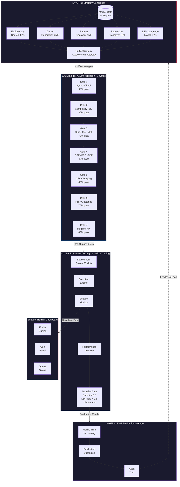
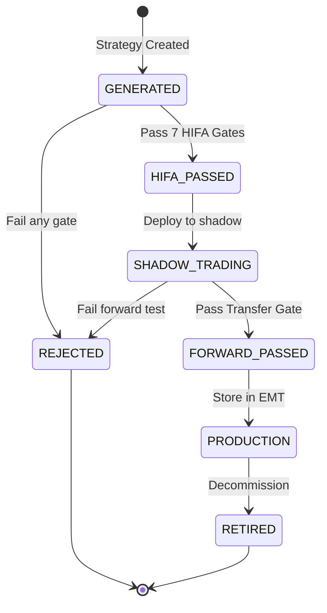
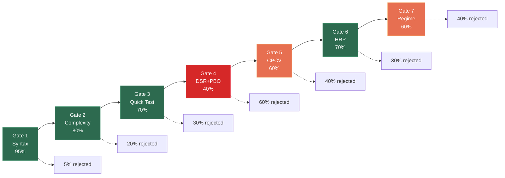

# EXPLORER PRIME

**Unified Quantitative Strategy Development Pipeline**

A complete end-to-end system for generating, validating, forward-testing, and deploying algorithmic trading strategies. Reduces false positive rate from ~50% to ~20% through rigorous multi-stage filtering.

---

## System Architecture



---

## Pipeline Overview

| Stage | Input | Output | Filter Rate |
|-------|-------|--------|-------------|
| **Generation** | Market data + regime | ~1000 UnifiedStrategy/day | - |
| **HIFA Validation** | Candidate strategies | HIFA-passed strategies | ~2-4% pass |
| **Forward Testing** | Validated strategies | Forward-tested strategies | ~50% pass |
| **Production** | Battle-tested strategies | Deployed strategies | Final ~1-2% |

---

## Modules

### `shared/` - Unified Strategy Format
The common data layer connecting all pipeline stages.

- **StrategyGenome** - DNA representation with tree structure, mutation, crossover operators
- **UnifiedStrategy** - Wrapper with full lifecycle tracking (`GENERATED` -> `HIFA_PASSED` -> `SHADOW_TRADING` -> `FORWARD_PASSED` -> `PRODUCTION` -> `RETIRED`)
- **FeatureVector** - 128-dimensional strategy feature representation
- **Adapters** - Converters for Explorer, LSM, and Hinance formats
- **Constants** - Thresholds (DSR, PBO, FDR, Transfer Ratio, DD Ratio, VIX regimes)

### `forward_testing/` - Shadow Trading Infrastructure
Live paper trading with realistic market simulation.

- **ExecutionEngine** - Market impact modeling, slippage, spread, fee simulation
- **PerformanceAnalyzer** - Sharpe, Sortino, drawdown, transfer ratio calculation
- **TransferGate** - 5-gate evaluation: transfer ratio >= 0.5, DD ratio < 1.5, min trades, min duration, min Sharpe
- **DeploymentQueue** - Priority-based queue with 50 concurrent shadow slots
- **ShadowMonitor** - Real-time health monitoring with 4-level alert system (INFO -> WARNING -> CRITICAL -> EMERGENCY)

### `emt/` - Production Storage
Merkle tree versioned strategy storage with audit trails.

- **EMTProduction** - Add, retire, verify strategies with cryptographic integrity
- **ProductionStrategy** - Production wrapper with version tracking
- **MerkleNode** - Hash tree for tamper-proof storage verification

### `orchestrator.py` - Master Pipeline
Connects all 4 layers into a single async pipeline.

```
run_full_pipeline(market_data, n_candidates=1000, regime=None) -> PipelineResult
```

Stages: Generate -> HIFA Validate -> Forward Test -> Production Store

### `dashboard/` - Shadow Trading Dashboard
Streamlit-based real-time monitoring interface.

- Strategy performance cards with health indicators
- Live equity curves (Plotly)
- Alert panel with severity levels
- Deployment queue capacity monitor
- Trade history tables
- Market regime indicator
- Demo mode with synthetic data

---

## Strategy Lifecycle



---

## Key Metrics

| Metric | Description | Threshold |
|--------|-------------|-----------|
| **Transfer Ratio** | `shadow_sharpe / backtest_sharpe` | >= 0.5 |
| **DD Ratio** | `shadow_max_dd / backtest_max_dd` | < 1.5 |
| **Minimum Trades** | Trades during shadow period | >= 30 |
| **Shadow Duration** | Minimum testing period | >= 14 days |
| **Minimum Sharpe** | Shadow Sharpe ratio | >= 0.3 |
| **DSR** | Deflated Sharpe Ratio | > 0.05 |
| **PBO** | Probability of Backtest Overfitting | < 0.40 |
| **FDR** | False Discovery Rate | < 0.20 |

---

## HIFA 7-Gate Validation



**Cumulative pass rate: ~2-4%** of initial candidates survive all 7 gates.

---

## Quick Start

### Run Tests
```bash
python -m pytest shared/ forward_testing/ tests/ -v
```

### Launch Dashboard
```bash
pip install streamlit plotly pandas numpy
streamlit run dashboard/shadow_dashboard.py
```

Or use the launcher:
```bash
python dashboard/run_dashboard.py
```

### Run Pipeline
```python
import asyncio
from orchestrator import UnifiedOrchestrator

async def main():
    orch = UnifiedOrchestrator()
    result = await orch.run_full_pipeline(market_data, n_candidates=1000)
    print(f"Production strategies: {result.production_count}")

asyncio.run(main())
```

---

## Project Structure

```
EXPLORER PRIME/
├── shared/                    # Unified strategy format & adapters
│   ├── __init__.py
│   ├── unified_strategy.py    # StrategyGenome, UnifiedStrategy
│   ├── adapters.py            # Explorer, LSM, Hinance adapters
│   ├── features.py            # 128-dim feature vector
│   ├── constants.py           # Thresholds & configuration
│   └── tests/
│       └── test_shared.py     # 35 tests
│
├── forward_testing/           # Shadow trading infrastructure
│   ├── __init__.py
│   ├── models.py              # Orders, positions, market state
│   ├── bridge.py              # Shadow deployment bridge
│   ├── deployment_queue.py    # Priority queue (50 slots)
│   ├── transfer_gate.py       # 5-gate transfer validation
│   ├── shadow_monitor.py      # Real-time monitoring & alerts
│   ├── execution/
│   │   └── engine.py          # Market simulation engine
│   ├── analytics/
│   │   └── performance.py     # Metrics & transfer ratio
│   └── tests/
│       └── test_forward_testing.py  # 38 tests
│
├── emt/                       # Production storage
│   ├── __init__.py
│   └── production.py          # Merkle tree versioned storage
│
├── dashboard/                 # Monitoring interface
│   ├── __init__.py
│   ├── shadow_dashboard.py    # Streamlit dashboard UI
│   ├── data_connector.py      # Data layer & demo mode
│   ├── run_dashboard.py       # Launcher script
│   └── requirements.txt
│
├── tests/                     # Integration tests
│   └── test_integration.py    # 21 tests
│
├── orchestrator.py            # Master pipeline coordinator
├── UNIFIED_SYSTEM_GUIDE.md    # Full system specification
└── README.md
```

---

## Test Coverage

| Module | Tests | Status |
|--------|-------|--------|
| `shared/` | 35 | All passing |
| `forward_testing/` | 38 | All passing |
| `tests/` (integration) | 21 | All passing |
| **Total** | **94** | **All passing** |

---

## Technology Stack

- **Python 3.11+**
- **Streamlit** - Dashboard UI
- **Plotly** - Interactive charts
- **Pandas / NumPy** - Data processing
- **asyncio** - Async pipeline orchestration
- **hashlib** - Merkle tree cryptographic hashing
- **pytest** - Testing framework

---

## Generation Engines

| Engine | Weight | Method |
|--------|--------|--------|
| **Evolutionary Search** | 40% | Genetic algorithms with mutation & crossover |
| **GenAI Generation** | 25% | AI-powered strategy synthesis |
| **Pattern Discovery** | 15% | Market pattern recognition |
| **Recombine Crossover** | 10% | Existing strategy recombination |
| **LSM Language Model** | 10% | Natural language to strategy conversion |

---

## License

Private repository. All rights reserved.
